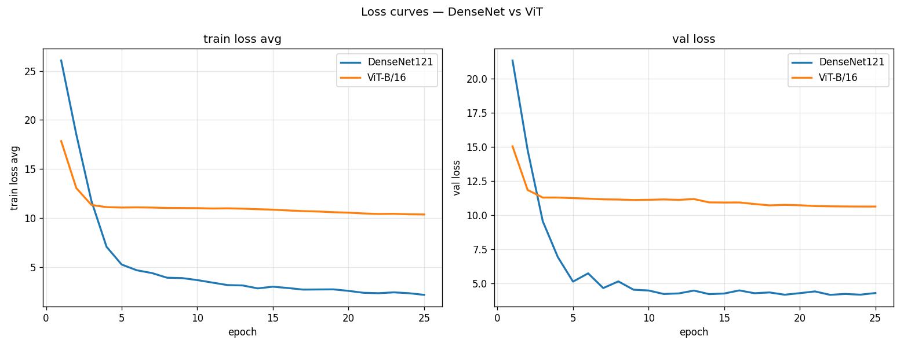
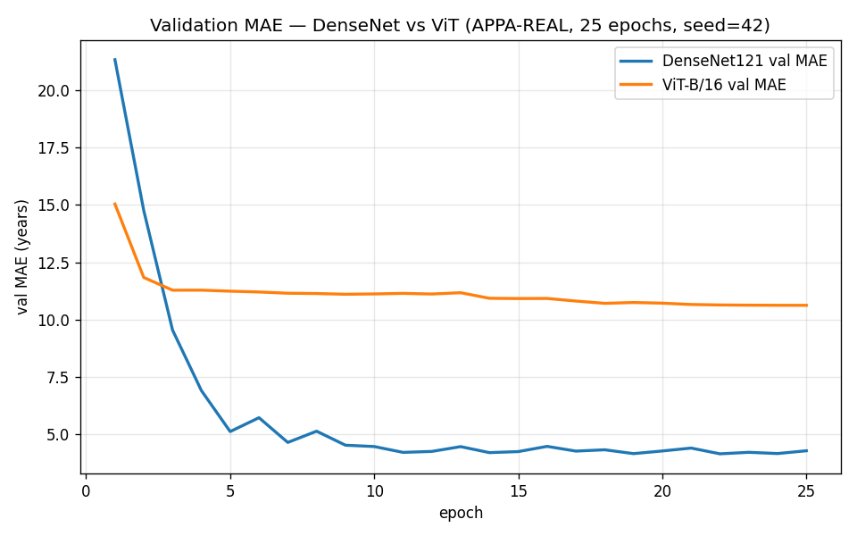
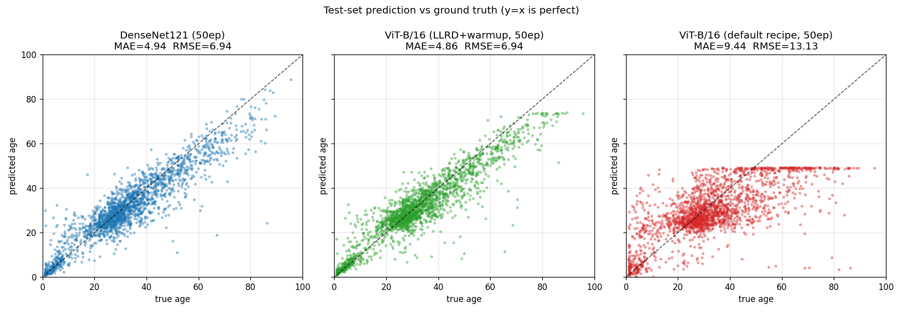
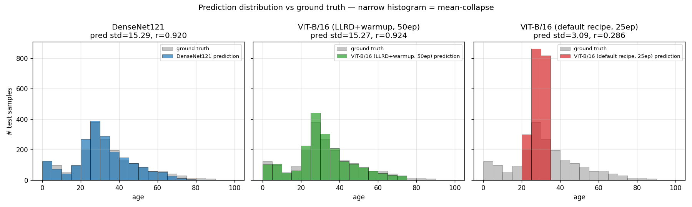
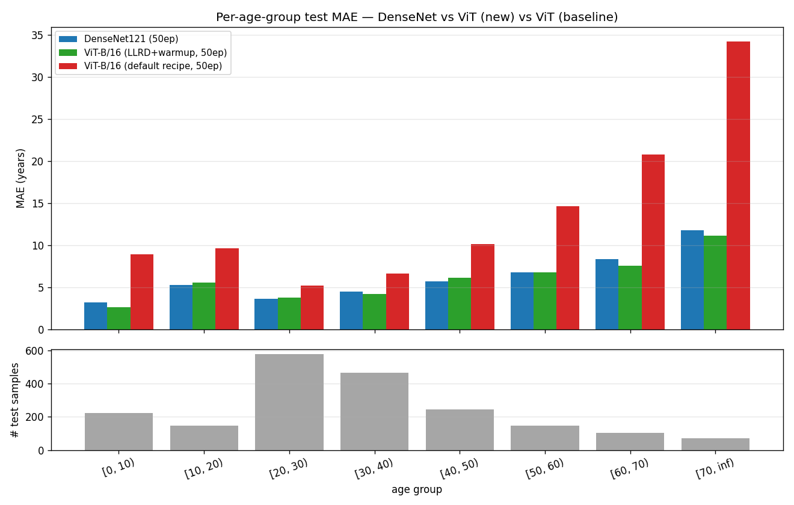

# XJTU 计算机视觉大实验：基于 DenseNet 与 ViT 的年龄估计

## 1. 实验目的

本实验在 APPA-REAL 表观年龄数据集上完成端到端的年龄估计任务，
并对两类具有代表性的图像表征模型进行受控对比：

1. 基于卷积神经网络的 DenseNet121；
2. 基于 Transformer 的 ViT-B/16。

目标包括：

- 将年龄估计建模为一维回归问题，使用统一的损失函数与评价指标完成训练与测试；
- 在尽可能公平的实验协议下比较 DenseNet 与 ViT 的整体表现以及在不同年龄段的差异；
- 通过 per-age-group 误差与预测分布观察两类归纳偏置（局部卷积 vs. 全局自注意力）
  在中等规模数据 + 长尾年龄分布下的实际表现；
- 通过一次 recipe ablation（ViT 新配方 vs. 默认 torchvision 配方）说明
  fine-tune 配方本身对 ViT 是否能 work 起决定性作用。

报告共涉及三次完整训练：DenseNet121、ViT-B/16（新配方）、ViT-B/16（默认配方
baseline），所有结论与数字均来自 `results/{densenet, vit, vit_baseline}/` 与
`results/comparison/` 目录下的日志文件，不做事后估计。

## 2. 实验环境

三次训练均在同一云端 GPU 服务器上完成，环境信息来自
`results/{densenet, vit, vit_baseline}/env_snapshot.txt`：

| 项目 | 值 |
|---|---|
| 操作系统 / Python | Python 3.12.3 |
| 深度学习框架 | torch 2.5.1+cu124 |
| CUDA / cuDNN | CUDA 12.4 / cuDNN 90100 |
| GPU | NVIDIA A800 80GB PCIe，单卡 |
| 主要依赖 | torchvision, pandas, numpy, PIL, tqdm, pyyaml, matplotlib |
| 随机种子 | 42（三次运行一致） |
| Git revision | DenseNet & ViT baseline：`6d40b0b`；ViT new：`605c112` |

三次运行在同一仓库内进行，差别仅来自 YAML 配置（`configs/densenet.yaml`
与 `configs/vit.yaml`，后者在 commit `605c112` 中被改成新配方）。运行命令为
`python main.py --model {densenet, vit} --mode all --seed 42 ...`，
通过 `--out_dir` 区分到不同子目录。每次运行额外保存
`config_snapshot.yaml`、`env_snapshot.txt`、`seed.txt`，与
`epoch_log.csv`、`step_log.csv`、`test_summary.txt`、
`per_age_group_mae.csv`、`pred_vs_true_scatter.png` 等结果文件，
便于复现与审计。

随机性控制：`src/utils.py::set_seed(42)` 同时设置
`random`、`numpy`、`torch`（CPU + CUDA）的种子，并开启
`torch.backends.cudnn.deterministic=True`、`cudnn.benchmark=False`，
DataLoader 的 `worker_init_fn` 给每个 worker 派生子种子。

## 3. 数据集介绍

实验使用 **APPA-REAL** 表观年龄数据集（Agustsson et al., 2017）。

- **来源**：APPA-REAL 官方发布版本，目录结构为
  `appa-real-release/{train,valid,test}/<file_name>_face.jpg`，
  标签文件为 `gt_avg_<split>.csv`。
- **标签语义**：使用 `apparent_age_avg` 字段，即多名标注者对同一张人脸图像给出的
  表观年龄（apparent age）的平均值，是连续实数。
- **Split 与样本数**：直接使用官方的 train / valid / test 划分，未做任何重切分。
  样本数取自 `gt_avg_<split>.csv` 的有效行数（去 header）：

  | 子集 | 样本数 | 用途 |
  |---|---:|---|
  | train | 4113 | 训练 |
  | valid | 1500 | 早停 / best-checkpoint 选择 |
  | test  | 1978 | 最终评估（仅一次） |

  注：训练时 `DataLoader` 启用 `drop_last=True`，每个 epoch 实际过
  `floor(4113/bs) × bs` 张样本（DenseNet 128 步 × 32 = 4096；ViT 257 步 × 16 = 4112），
  少量样本会被当前 epoch 跳过，多 epoch 之间随机打乱让训练集整体覆盖到位，
  无系统偏差。`step_log.csv` 仅按 20 步采样一次，**不可用于反推训练集大小**。
- **Ignore list**：dataset 模块支持 `ignore_list.csv` 自动剔除标注质量差的样本
  （见 `src/dataset.py`）。
- **年龄分布**：测试集呈典型长尾分布。

测试集年龄段样本数（来自 `per_age_group_mae.csv`，三次运行 N 列一致）：

| 年龄段 | 样本数 | 占比 |
|---|---:|---:|
| [0, 10)   | 222 | 11.2% |
| [10, 20)  | 147 |  7.4% |
| [20, 30)  | 579 | 29.3% |
| [30, 40)  | 465 | 23.5% |
| [40, 50)  | 244 | 12.3% |
| [50, 60)  | 146 |  7.4% |
| [60, 70)  | 104 |  5.3% |
| [70, inf) |  71 |  3.6% |

主峰集中在 20-40 岁（52.8%），两端 [0, 10) 与 [70, inf) 都属于稀疏区域，
误差分析会专门检查这部分。

## 4. 数据预处理方法

三次运行共用同一套预处理流水线（`src/dataset.py::build_transform`），
这是公平实验协议的一部分。

**训练集** (`train=True`)：

1. `Resize` 到 `(258, 258)`（即 `int(224 * 1.15)`），略大于网络输入；
2. `RandomCrop(224, 224)`，提供轻度位置扰动；
3. `RandomHorizontalFlip(p=0.5)`，人脸左右对称先验下的标准增强；
4. `ColorJitter(brightness=0.2, contrast=0.2, saturation=0.2)`，光照鲁棒性；
5. `ToTensor()`；
6. `Normalize(mean=[0.485, 0.456, 0.406], std=[0.229, 0.224, 0.225])`，
   ImageNet 统计量（与 torchvision 预训练权重对齐）。

**验证 / 测试集** (`train=False`)：

1. `Resize` 直接到 `(224, 224)`；
2. `ToTensor()`；
3. 同一组 ImageNet `Normalize`。

设计动机：DenseNet 与 ViT 的 torchvision 预训练权重均以 ImageNet
mean/std 归一化、224×224 输入为前提，使用统一预处理可同时满足两者，
也避免预处理差异污染对比结果。未使用 mixup / CutMix / RandAugment 等更强增广，
原因有二：(a) 与课程项目所要求的简洁可复现配方一致；(b) 三次运行使用同样
增广，保证配方差异只来自 optimizer / scheduler 部分。

## 5. 年龄估计任务建模

年龄是一维连续实数，将其建模为**回归任务**比建模为分类任务更自然：

- 分类视角下，年龄被离散化为 N 个类别，所有相邻类别在交叉熵下的距离相等。
  但实际中 "把 23 岁预测成 24 岁" 与 "把 23 岁预测成 80 岁" 的代价显然不同，
  分类形式直接丢失了这一连续结构。
- 回归视角下，模型直接输出一个标量年龄 `y_hat`，损失函数与评价指标都
  按照实数距离定义，恰好匹配任务语义。

**损失函数**：三次运行均使用 `nn.L1Loss()`（即 MAE 损失，
配置文件中 `loss: l1`）。选择 L1 而非 MSE 是因为：

- L1 对异常标签（噪声年龄）更鲁棒（表观年龄本身有人工方差）；
- L1 与最终评价指标 MAE 单位一致，优化目标 = 评价目标，
  避免训练 / 评价不一致带来的优化 bias。

**评价指标**：

- **MAE**（Mean Absolute Error）：`mean(|y_hat - y|)`，单位为「岁」，主指标；
- **RMSE**（Root Mean Squared Error）：`sqrt(mean((y_hat - y)^2))`，
  对大误差更敏感，反映尾部行为；
- **Per-age-group MAE**：将测试集按 10 岁分桶统计 MAE，反映长尾段表现；
- **Pearson r** 与 **pred_std**：检验模型预测分布是否塌缩到一点（用于
  判断是否退化为均值预测器）。

模型输出头统一为 `Linear(in_features, 1)`，forward 后通过 `squeeze(1)`
压成 `(B,)` 与标签计算损失（`src/train.py`）。
回归输出无值域约束，理论上可能出现负数或大于 100 的预测，
分析时按原始值统计（不做 clip），以反映模型的真实行为。

## 6. DenseNet 模型设计

**架构来源**：Huang et al., *Densely Connected Convolutional Networks*, CVPR 2017。

**具体实现**（`src/models.py::_build_densenet`）：

```python
weights = tvm.DenseNet121_Weights.IMAGENET1K_V1
model = tvm.densenet121(weights=weights)
in_features = model.classifier.in_features    # 1024
model.classifier = nn.Linear(in_features, 1)  # 回归头
```

关键设计点：

- **直接复用 torchvision 的 `densenet121`**：4 个 Dense Block 共 121 层，
  通道增长率 32，最后一个全局池化层输出 1024 维特征；
- **预训练权重**：加载 IMAGENET1K_V1，作为 backbone 的初始化；
- **替换 classifier**：原 `Linear(1024, 1000)` -> `Linear(1024, 1)`；
- **全网络微调**：未冻结任何层，所有参数都参与梯度更新。

DenseNet 通过密集连接强化梯度流，并在每层显式重用前层特征，
具有较强的局部纹理建模能力，对面部皱纹、毛孔等与年龄相关的局部特征友好。

## 7. ViT 模型设计

**架构来源**：Dosovitskiy et al., *An Image is Worth 16x16 Words*, ICLR 2021。

**具体实现**（`src/models.py::_build_vit_b_16`）：

```python
weights = tvm.ViT_B_16_Weights.IMAGENET1K_V1
model = tvm.vit_b_16(weights=weights)
in_features = model.heads.head.in_features    # 768
model.heads.head = nn.Linear(in_features, 1)  # 回归头
```

关键设计点：

- **使用 torchvision 的 `vit_b_16`**：Patch size 16、12 个 Transformer
  encoder 层、12 个 attention head、隐藏维 768、MLP 维 3072；
  224x224 输入对应 14x14 = 196 个 patch token（加 1 个 CLS token）；
- **预训练权重**：IMAGENET1K_V1。ViT 缺少卷积的平移等变 / 局部性归纳偏置，
  对预训练的依赖性远高于 CNN；
- **替换 `heads.head`**：torchvision 的 ViT 头部是 `Sequential` 结构，
  最后一层 `Linear(768, 1000)` 替换为 `Linear(768, 1)`；
- **全网络微调**：与 DenseNet 一致，整网可训练。但 ViT 对 fine-tune
  配方比 CNN 更敏感 —— 第 11 节 ablation 显示：
  默认 torchvision 配方（AdamW lr=5e-5 flat + cosine→0 + 25 ep + wd=0.05）
  会导致 ViT 塌缩到均值预测器；本实验主 ViT 运行采用 **LLRD + linear warmup +
  50 ep + 较弱 wd** 的新配方，使其能在小数据上正常学习。详见 §8.2。

ViT 通过自注意力建模 patch 之间的全局关系，理论上能捕捉跨区域的面部
结构特征（如对称性、整体轮廓与年龄相关的特征分布），与 CNN 的局部纹理
建模形成互补。

## 8. 训练方法与参数设置

### 8.1 公平实验协议

为保证三次运行的结果可比，下列维度严格一致：

- **同一份随机种子**：`seed=42`，覆盖 `random`、`numpy`、`torch`、CUDA、
  DataLoader generator、worker init；
- **同一份 data split**：APPA-REAL 官方 train / valid / test = 4113 / 1500 / 1978，
  未做任何重切分；
- **同一组 augmentation 策略**：见第 4 节，由
  `src/dataset.py::build_transform` 共享；
- **同一种损失函数**：`nn.L1Loss()`；
- **同一组 ImageNet mean/std normalize**；
- **同一个训练循环**：`src/train.py::run_training`（src/train.py:128），
  全局共用，代码中**没有** `if model_name == "vit"` 的特判分支；
- **同样的输入尺寸**：224x224；
- **同样的 best-checkpoint 选择**：以 `val_mae` 最低对应的 checkpoint 评估 test。

仅有的差异由各自的 YAML 配置（`configs/densenet.yaml`、`configs/vit.yaml`）
驱动。

### 8.2 三次运行的配方对比

| 维度 | DenseNet | ViT (new) | ViT (baseline) |
|---|---|---|---|
| optimizer | Adam | AdamW | AdamW |
| base lr | 1e-4 | 2e-4 (head, base) | 5e-5 (flat) |
| LLRD | — | decay 0.75 | — |
| warmup | — | linear, 5 epoch (start factor 0.01) | — |
| scheduler | StepLR (γ=0.5, step=10) | cosine -> η_min=3e-7 | cosine -> 0 |
| weight_decay | 0 | 0.01 | 0.05 |
| batch_size | 32 | 16 | 16 |
| epochs | 25 | 50 | 25 |

**ViT (new) 配方细节**：LLRD 给最靠近输出的 head 与 final LayerNorm 最大学习率
（base_lr = 2e-4），向 backbone 深处衰减：第 k 层 encoder block 学习率为
`2e-4 × 0.75^(12-k)`，最底层 patch embedding 大约
`2e-4 × 0.75^13 ≈ 4.75e-6`。LayerNorm / bias / pos_embedding / class_token
等参数 `weight_decay` 设为 0（标准 transformer 约定）。warmup 阶段
前 5 epoch lr 从 `0.01 × base_lr` 线性升到 `base_lr`，随后 45 epoch
cosine 衰减到 `η_min=3e-7`。这一组配方在 `configs/vit.yaml` 中显式定义，
未在代码中硬编码。

**ViT (baseline) 配方**：接近 torchvision 文档默认的 fine-tune 配方 ——
单一 lr=5e-5 平摊到所有参数、25 epoch、cosine 衰减到 0、wd=0.05。
两次 ViT 运行的 backbone、head 替换、数据流水线、loss 完全相同；唯一
差异是上表中的 optimizer / scheduler / wd / batch_size / epochs / LLRD。

**DenseNet 配方**：Adam（无 weight decay）+ StepLR 每 10 epoch 衰减一次
（γ=0.5），batch_size=32，25 epoch，是 CNN 微调的常见配方。

### 8.3 训练循环

`run_training()` 内部每个 epoch 顺序执行：

1. `train_one_epoch`：在训练集上跑一遍，记录 step-level batch loss（每 20
   步记录一次）与 epoch 平均 train_loss；
2. `evaluate`：在验证集上前向，记录 val_loss / val_mae / val_rmse；
3. `scheduler.step()`：epoch-level 调整 lr；
4. 保存 `last` checkpoint；当 `val_mae < best_val_mae` 时另存 `best`；
5. 写出 `epoch_log.csv`，flush `step_log.csv`。

测试阶段在 `best.pth` 上跑测试集一次，保存预测、ground truth、
file_names 与 `test_summary.txt`。

## 9. 实验结果

### 9.1 主对比表（test，单 seed=42）

直接来自 `results/comparison/comparison_table.csv` 与各自的 `test_summary.txt`：

| 指标 | DenseNet | ViT (new) | ViT (baseline) |
|---|---:|---:|---:|
| 训练 epoch 数 | 25 | 50 | 25 |
| best epoch (by val MAE) | 22 | 37 | 25 |
| best val MAE | 4.159 | **4.127** | 10.628 |
| best val RMSE | 6.388 | **6.196** | 14.256 |
| test MAE | 5.064 | **4.861** | 13.009 |
| test RMSE | 7.190 | **6.943** | 17.627 |
| Pearson r(pred, gt) | 0.920 | **0.924** | 0.286 |
| pred std (test) | 15.29 | 15.27 | 3.09 (gt std: 17.67) |
| mean epoch time (s) | 9.3 | 36.2 | 35.9 |
| GPU peak (MB) | 4122.6 | 2990.8 | 2989.8 |

加粗为该指标下最优值。三次运行均跑完计划 epoch，未早停。
**best epoch** 是按验证集 MAE 最低选出的，对应的 `<model>_best.pth`
checkpoint 即为 test 评估所用模型。test 指标反映的是 best 那一版的泛化表现，
而非最后一个 epoch。

### 9.2 训练曲线（loss / MAE）



三个模型的 train_loss 与 val_loss 叠加。DenseNet 与 ViT (new) 都呈现明显
持续下降；ViT (baseline) 在 epoch 3 之后 val_loss 几乎不再下降。



val_mae 曲线更直接地呈现 best-epoch：DenseNet 在 epoch 22 取得 best val MAE
4.159；ViT (new) 在 epoch 37 取得 best 4.127；ViT (baseline) 在 epoch 25
（最后一轮）取得 best 10.628，且早从 epoch 4 起 val MAE 一直卡在 10.6-11.3
区间，几乎没有进展。

### 9.3 预测 vs. 真值散点



三个面板分别展示 DenseNet、ViT (new)、ViT (baseline) 在测试集上的预测散点。
DenseNet 与 ViT (new) 沿对角线分布，主要散点集中在 20-40 真实年龄区间，长尾
段散点稀疏但仍跟随对角线；ViT (baseline) 的散点**完全压缩在 y ≈ 28** 附近的
一条窄带 —— 不论真实年龄是 5 还是 80，预测都几乎不动，是典型的塌缩到均值
预测器。

### 9.4 预测分布 vs. 真值分布



ground truth 测试集的标准差为 17.67（覆盖 0-90 岁全谱）。DenseNet 与 ViT (new)
的预测分布与之高度重合（pred std 15.29 / 15.27）；ViT (baseline) 的
预测分布是一个 std=3.09 的窄峰，集中在 20-32，**几乎是常数预测**。

各模型自带的单模型 loss / MAE 曲线与 scatter 图：

- DenseNet：`../results/densenet/{loss_curve, mae_curve, pred_vs_true_scatter}.png`
- ViT (new)：`../results/vit/{loss_curve, mae_curve, pred_vs_true_scatter}.png`
- ViT (baseline)：`../results/vit_baseline/{loss_curve, mae_curve, pred_vs_true_scatter}.png`

## 10. DenseNet 与 ViT 对比分析

### 10.1 整体观察

ViT (new) 的 test MAE 4.861 比 DenseNet 的 5.064 低约 0.20 岁
（相对约 4.0% 提升），test RMSE 也由 7.190 改善到 6.943。Pearson r
两者非常接近（0.924 vs. 0.920），说明模型整体单调一致性都很好。
**ViT (new) 微胜 DenseNet**，但 gap 仅约 0.2 岁，且只是单 seed 单次运行，
**不应将其解读为「ViT 永远更好」**，详见第 12 节限制。

### 10.2 Per-age-group MAE

数据来自三份 `per_age_group_mae.csv`：

| 年龄段 | N | DenseNet | ViT (new) | ViT (baseline) | DN vs ViT (new) 更优 |
|---|---:|---:|---:|---:|:---:|
| [0, 10)   | 222 |  3.03 |  2.62 | 22.32 | **ViT (new)** |
| [10, 20)  | 147 |  5.44 |  5.57 | 11.67 | DenseNet |
| [20, 30)  | 579 |  3.70 |  3.76 |  3.67 | DenseNet |
| [30, 40)  | 465 |  4.64 |  4.23 |  5.52 | **ViT (new)** |
| [40, 50)  | 244 |  5.90 |  6.11 | 15.30 | DenseNet |
| [50, 60)  | 146 |  6.93 |  6.81 | 24.91 | **ViT (new)** |
| [60, 70)  | 104 |  8.50 |  7.59 | 34.65 | **ViT (new)** |
| [70, inf) |  71 | 12.81 | 11.15 | 47.81 | **ViT (new)** |



关键观察：

1. **主峰附近 [20, 30) / [40, 50) 平手或 DenseNet 略胜**：DenseNet 凭借
   局部纹理（皱纹、皮肤质感）等卷积先验在密集训练区段表现稳定，差距很小
   （≤ 0.21）。
2. **ViT (new) 在两端长尾胜出**：[0, 10) 与 [70, inf) ViT (new) 分别
   领先 0.41 与 1.66 岁。这与 ViT 的全局 self-attention 能跨整张人脸
   聚合多种线索（头型、面部比例、整体特征分布）的解释一致，对极端
   年龄段（婴幼儿 / 高龄）这种局部纹理与整体形态差异都很大的样本
   有一定优势。
3. **[30, 40) 主峰外缘 ViT (new) 略胜 0.41**，与长尾趋势一致。
4. **ViT (baseline) 在长尾段彻底崩坏**：[70, inf) MAE 47.81、[60, 70) MAE 34.65
   —— 是一个把所有人都预测成 ~28 岁的常数预测器，详见 §11。

综合 8 个年龄桶，ViT (new) 在 **5/8** 桶中胜出。

### 10.3 训练资源对比

| 维度 | DenseNet | ViT (new) | ViT (baseline) |
|---|---|---|---|
| 单 epoch 时间 (s) | 9.3 | 36.2 | 35.9 |
| 总训练时间 (s) | ≈ 233 | ≈ 1809 | ≈ 898 |
| GPU peak 显存 (MB) | 4122.6 | 2990.8 | 2989.8 |

ViT 单 epoch 时间约为 DenseNet 的 ~3.9 倍，新配方又跑了 2 倍 epoch，
因此 ViT (new) 总训练时间约为 DenseNet 的 ~7.8 倍。**显存反而较低**，因为
batch_size=16 < 32。换言之，ViT (new) 用 ~7.8× 训练成本换来约 4% 的 test MAE
改善 —— 在课程项目层面是值得的取舍，但实际部署需谨慎评估。

## 11. 误差分析 + Recipe Ablation（ViT new vs ViT baseline）

本节是新报告中最重要的章节，目的是说明：**同一份代码与数据下，仅
fine-tune 配方差异就能让 ViT 的 test MAE 从 13.01 降到 4.861**。

### 11.1 baseline 塌缩的实证

ViT (baseline) 在测试集上的表现（直接来自
`results/vit_baseline/test_summary.txt` 与 `per_age_group_mae.csv`）：

- test MAE 13.01、test RMSE 17.63 —— 比 DenseNet 差 2.57×；
- **Pearson r = 0.286** —— 接近随机 / 常数预测；
- **pred std = 3.09**，而 **gt std = 17.67** —— 预测压缩到原始分布 1/5.7 宽度；
- 预测主要分布在 (20, 32) 区间（见 §9.4 图），覆盖 gt 范围的约 22%-35%；
- per-age-group MAE 在长尾段崩坏：[70, inf) 桶 MAE 47.81，与「预测永远 ≈28」
  的常数预测器表现完全吻合。

ViT (baseline) 的 epoch trajectory（来自 `results/vit_baseline/epoch_log.csv`）：

| epoch | val_mae | 备注 |
|---:|---:|---|
| 1 | 15.04 | 起点 |
| 2 | 11.84 | head 快速学到「猜均值」 |
| 3 | 11.29 | val 接近随机均值的 MAE |
| 4 | 11.29 | **基本停止学习** |
| 5-13 | 10.93-11.18 | 平台期 |
| 14-20 | 10.71-10.93 | 极小幅波动 |
| 25 | 10.63 | best epoch |

从 epoch 4 起，val MAE 一直卡在 10.6-11.3 区间，22 个 epoch 几乎没有进展。
train_loss 持续从 11.06 缓慢降到 10.35（过拟合都没发生 —— 本质是 backbone
早就锁死，只剩 head 在做微小调整）。

### 11.2 为什么 baseline 会塌缩

将 ViT (baseline) 与 ViT (new) 的关键差异拆解：

1. **flat lr=5e-5 对全 backbone 太弱**：随机初始化的 head 一开始随机预测，
   loss 大；AdamW 用 5e-5 让 head 快速学到「预测一个均值」就能把 loss 从
   17.84 降到 ~11；此后 head 已经收敛到「常数预测器」的局部解，而 5e-5 对
   87M 参数的预训练 backbone 实在太小 —— backbone 几乎不动。结果就是
   「head 学到均值后，整张模型锁死」。
2. **wd=0.05 过强**：head 刚学到的少量年龄相关信号被 weight decay 持续
   压回 0，进一步加剧塌缩。
3. **cosine 直接到 0 + 25 epoch 太短**：lr 在 epoch 25 已经降到 1.97e-7
   （见 `vit_baseline/epoch_log.csv`），即便此刻有信号也学不进去；
   而 25 epoch 在 backbone 几乎不动的情形下根本不够。
4. **无 warmup**：epoch 1 上来就 5e-5，AdamW 的二阶矩 estimate 还不稳定，
   第一批 large gradient 会污染 m / v 累积量，加剧 head 走向均值预测的捷径。

四个因素叠加，模型卡在「均值预测器」局部最优。

### 11.3 新配方为什么有效

ViT (new) 用 LLRD + warmup + 50 epoch + 较弱 wd 修复了上述每一个问题：

1. **LLRD (decay 0.75)**：head 拿到 2e-4（4× baseline lr），有足够动力
   学到真实年龄回归；同时最底层 patch embedding 只有 ~4.75e-6，
   backbone 缓慢且稳定地微调。**head 与 backbone 不再争夺同一个 lr**。
2. **Linear warmup（5 epoch）**：前 5 epoch lr 从 2e-6 线性升到 2e-4。
   `vit/epoch_log.csv` 显示 epoch 1 起点 lr=2e-6，epoch 6 升到 2e-4。
   warmup 期间 AdamW 的 m, v 累积量充分稳定，避免大梯度污染。
3. **50 epoch + cosine to η_min=3e-7**：更长 budget 给了 backbone 充分
   调整时间。`vit/epoch_log.csv` 中 val MAE 从 epoch 1 的 22.38 平稳下降
   到 epoch 37 的 4.127，曲线整体单调。
4. **wd=0.01（vs. 0.05）**：减少对刚学到的 head 信号的压制。
5. **同一份代码、同一个 `run_training()`**：这表明改进**完全来自配方**，
   不是某种特殊的训练循环或正则化技巧。

### 11.4 数字层面的差距

| 指标 | ViT (baseline) | ViT (new) | 改善 |
|---|---:|---:|---:|
| best val MAE | 10.628 | 4.127 | −6.501 |
| test MAE | 13.009 | 4.861 | **−8.148** |
| test RMSE | 17.627 | 6.943 | −10.684 |
| Pearson r | 0.286 | 0.924 | +0.638 |
| pred std | 3.09 | 15.27 | ≈ 5× |

仅切换配方（同 backbone、同代码、同数据、同 loss、同种子），ViT 的 test MAE
就从 13.01 降到 4.861，相对**误差减少 ~2.68×**。

### 11.5 DenseNet vs ViT (new) 的失败模式

两个能正常学习的模型在长尾段都有显著误差膨胀：

- [70, inf)：DenseNet MAE 12.81 / ViT (new) 11.15，远高于整体 MAE ~5；
- [60, 70)：DenseNet 8.50 / ViT (new) 7.59；
- [0, 10)：DenseNet 3.03 / ViT (new) 2.62（绝对误差较小，但相对误差仍可观）。

主因来自**训练分布偏移**：训练集主要集中在 20-50 岁，长尾段样本少，
模型对极端年龄段的回归方差自然更大。这也是为什么两者 RMSE / MAE 比值
（DN：7.19 / 5.06 ≈ 1.42；ViT (new)：6.94 / 4.86 ≈ 1.43）都明显大于 1：
少数长尾样本的大误差被平方放大。

此外，APPA-REAL 是 *apparent* age 标签，本身有不可消除的标注主观性
（不同标注者对同一张脸给出的年龄差异常常在 ±5 岁以内）。这给所有模型设了
MAE 大约 3-4 岁的不可逾越下限 —— DenseNet 与 ViT (new) 在 [0, 10)、
[20, 30) 段已经接近这个下限，说明它们在样本密集区已经基本饱和。

### 11.6 教训

**对中等规模数据 + 预训练 ViT，fine-tune 配方比模型架构本身更决定结果。**
课程项目常见的「照搬 torchvision 默认配方」workflow 对 ConvNet 通常没问题，
但对 ViT 可能直接塌缩到均值预测。一个有效的最小 recipe 组合是：
LLRD + linear warmup + 适当延长 epoch + 适中 weight decay。这个观察在数字
层面相当极端（test MAE 由配方差异从 13.01 -> 4.861），是本实验最重要的发现
之一，也是与旧版报告结论反转的根源。

## 12. 总结

### 12.1 主要结论

1. 本实验在 APPA-REAL 上完成了 DenseNet121 与 ViT-B/16 的年龄估计回归任务，
   并通过统一的训练循环 + 受控差异 YAML 实现了三次受控运行的公平对比。
2. 在单 seed=42 的受控对比下，**ViT-B/16 (LLRD + warmup, 50 ep) 微胜
   DenseNet121**：test MAE 4.861 vs. 5.064（差 −0.203），Pearson r
   0.924 vs. 0.920。两者整体单调一致性都很好，差距仅约 0.2 岁。
3. **逐年龄段分析**：ViT (new) 在 5/8 年龄桶中表现更好，尤其在两端长尾
   [0, 10) 与 [70, inf) 优势明显（−0.41 与 −1.66）；DenseNet 在 [10, 20) /
   [20, 30) / [40, 50) 这种局部纹理主导的中段略胜，但差距 ≤ 0.21。
4. **Recipe ablation 是本实验最强信号**：将 ViT 配方从 torchvision 默认换成
   LLRD + warmup + 50 ep，test MAE 由 13.009 -> 4.861（≈ 2.68× 误差减小）；
   同一份 backbone 与训练代码下，**配方决定 ViT 能否 work**。ViT (baseline)
   塌缩到均值预测器（Pearson r=0.286，pred std=3.09），而 ViT (new) 完整学到
   年龄回归（Pearson r=0.924，pred std=15.27）。
5. **训练效率**：DenseNet 每 epoch ~9.3 s（25 ep ≈ 233 s），ViT 每 epoch
   ~36 s（50 ep ≈ 1809 s）。ViT 总 wall-clock 长是因为 epoch 多 + 单步慢；
   显存反而较低，因 batch_size=16 < 32。

### 12.2 实验限制

1. **单 seed 运行**：所有数字来自 seed=42 一次运行，0.2 岁的胜差完全可能
   在多 seed 下被噪声覆盖。"ViT (new) 微胜 DenseNet" 是
   description-of-result，**不构成 architecture-level claim**。
2. **APPA-REAL 自身**：年龄标签是众包平均「表观年龄」，本身有 noise；
   数据量中等（4113 / 1500 / 1978），换更大数据（IMDB-WIKI / UTKFace）
   可能改变结论。
3. **训练 budget 不对称**：ViT (new) 跑了 50 epoch，DenseNet 只跑了 25。
   将 DenseNet 延长到 50 epoch 可能略微改善它。本实验未做该项对照。
4. **未做 test-time augmentation / model ensemble**：相比常见 SOTA pipeline
   缺失了这些常见后处理步骤。
5. **未做更强增广**：未尝试 mixup / CutMix / RandAugment / stochastic depth /
   layer-wise weight decay；未网格搜索 LLRD decay 系数（0.75 是
   ViT fine-tuning 文献中的常用值，未做敏感性分析）。
6. **未做置信度估计 / 不确定性建模**：实验只输出 point estimate，
   未估计 per-sample 不确定性。

### 12.3 可扩展方向

1. **多 seed (≥3)**：取均值 + 标准差，给出 ViT vs DN 差距的置信区间；
2. **DenseNet 50 epoch 复跑**：做训练 budget 对照；
3. **更强数据增广（mixup / CutMix / RandAugment）**：看是否能进一步缩小
   长尾段误差；
4. **LLRD decay 网格搜索**（0.65 / 0.70 / 0.75 / 0.80 / 0.85），评估对
   ViT 训练稳定性的影响；
5. **Test-time augmentation**（horizontal flip 平均）：最便宜的预期提升手段；
6. **回归头换成 ordinal regression**（DEX / mean-variance / DLDL）：年龄
   估计常见技巧，可作进一步对比；
7. **更大数据集（IMDB-WIKI / UTKFace）重做对比**：检验 ViT 微胜在更大
   数据规模下是否扩大。

### 12.4 一句话总结

在 APPA-REAL 单 seed 受控对比下，ViT-B/16（LLRD + warmup + 50 ep）以
test MAE 4.861 微胜 DenseNet121 的 5.064；**但更重要的发现来自 recipe
ablation**：同一份 ViT backbone 仅切换 fine-tune 配方，test MAE 即从 13.01
塌缩值下降到 4.861，说明对中等规模数据 + 预训练 ViT，fine-tune 配方
比模型架构本身更决定结果。

---

附：所有实验输出文件位于 `results/{densenet, vit, vit_baseline}/` 与
`results/comparison/`；配置在 `configs/{densenet, vit}.yaml`；
代码在 `src/` 与入口 `main.py`。复现命令：

```bash
python main.py --model densenet --mode all --seed 42
python main.py --model vit      --mode all --seed 42
```
